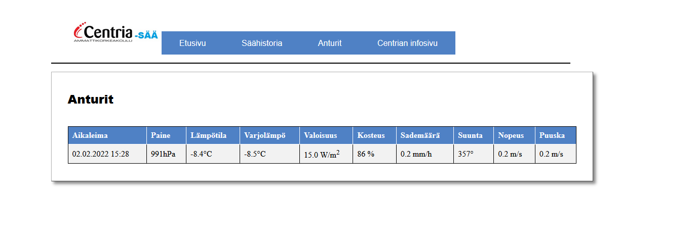
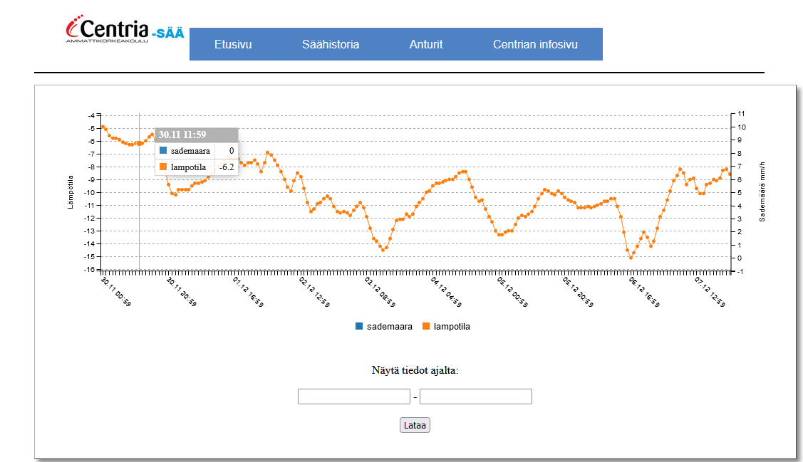

Säädata tuli RS-232 pitkin. Tehtävänä oli muun muassa parseroida data ja tallentaa tietokantaan.
Tämä toteutettiin python koodin avulla ja datan näyttäminen PHP-koodilla.
Säähistoria löytyy myös graafisesta taulukosta.

Ryhmä projekti oli osana Client Server Programming kurssia.
[Linkki](http://secret.cop.fi/asema/anturit.php) sivuille.

{ #image_id }

